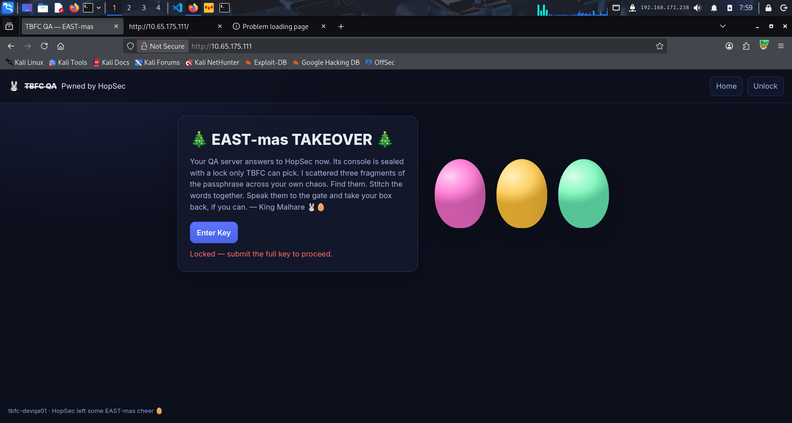

## Walkthrough of Day07 - Network Discovery - Scan-ta Clause


## Theory - What will we learn?
1. Learn the basics of network service discovery with Nmap
2. Learn core network protocols and concepts along the way
3. Apply your knowledge to find a way back into the server


## Basic scan

```bash
nmap -p- -T4 10.65.175.111
Starting Nmap 7.95 ( https://nmap.org ) at 2025-12-10 07:42 EST
Nmap scan report for 10.65.175.111
Host is up (0.15s latency).
Not shown: 65531 filtered tcp ports (no-response)
PORT      STATE SERVICE
22/tcp    open  ssh
80/tcp    open  http
21212/tcp open  trinket-agent
25251/tcp open  unknown
```

* 4 open ports:
    * 22        ssh
    * 80        http
    * 21212     trinket-agent
    * 25251     tcp open  unknown

Lest check the website running in port 80



### Answer to question 1 `Pwned by HopSec`
* We see there are 3 hidden parts of a password hidden somewhere on the system
* Only with the 3 parts combined we can onlock the website


### Full scan
* lets scan the other ports we found
`nmap -p 22,80,21212,25251 -sC -sV -T4 10.65.175.111 -A -oN FULL_nmap_scan`

* Lets analyze the output:
22/tcp    open  ssh     OpenSSH 9.6p1 Ubuntu 3ubuntu13.14 (Ubuntu Linux; protocol 2.0)
80/tcp    open  http    nginx
21212/tcp open  ftp     vsftpd 3.0.5
25251/tcp open  unknown
* we found the 2 key info
    * The OS we scanning is `Ubuntu Linux`
    * We have ftp service running

`21212/tcp open  ftp     vsftpd 3.0.5
| ftp-anon: Anonymous FTP login allowed (FTP code 230)
`

#### Anonymous allowed!!!  -----> Lets Connect

`ftp -p 10.65.175.111 21212`

#### Output:

`230 Login successful.`

```
ls

-rw-r--r--    1 ftp      ftp            13 Oct 22 16:27 tbfc_qa_key1
```

##### We have a file on the system named `tbfc_qa_key1` -----> Lets download it

```
ftp> get tbfc_qa_key1

226 Transfer complete.

```
#### Lest cat the file
```
cat tbfc_qa_key1 
KEY1:3aster_

```
### Answer to question 2 `3aster_`
##
### Lets investigate the unknown port `25251`
* nmap couldnt find the service
* The -sC resulted the string --> 

```
Help: 
|     TBFC maintd v0.2
|     Type HELP for commands.
|     Commands: HELP, STATUS, GET KEY, QUIT` 

```
Lets try to connect to the service and use the `get key` command

```
nc 10.65.175.111 25251
TBFC maintd v0.2
Type HELP for commands.
help
Commands: HELP, STATUS, GET KEY, QUIT
get key
KEY2:15_th3_

```

### Answer to question 3 --->  `15_th3_`

##
### Until now we scanned only tcp, But what about UDP?
```bash
nmap -sU 10.65.140.16

#Output
PORT   STATE SERVICE
53/udp open  domain

```
* We see dns service, Lets investigate with dig

dig @10.64.166.224 TXT key3.tbfc.local +short

### Answer to question 3 --->  `n3w_xm45`

##
### Full Flag ---> `3aster_15_th3_n3w_xm45`
##
* WE have reached to the final step
* We have a shell,lets print all the listening port on the machine
* We have 2 Ways:
1. Old machines --> `netstat -tapn`
2. New machine  --> `ss -tunlp`

Lets use `ss`
We will focus on the ports listening on 127.0.0.1 --> Admin host
```bash
Netid  State          Local Address:Port      Peer Address:Port  Process                   
                            
tcp    LISTEN               127.0.0.1:8000           0.0.0.0:*
tcp    LISTEN                127.0.0.1:3306           0.0.0.0:*                               
tcp    LISTEN               127.0.0.1:7681           0.0.0.0:*                               
tcp    LISTEN                    [::]:22                [::]:*  
```
1. 7681 --> The "Web Terminal" (ttyd) --> share linux terminal over the web
2. 3306 --> mysql --> database
### Answer to question 4 --->  `3306'
3. 8000 --> usually web application


Lets check the sql database for intresting information
```bash
tbfcapp@tbfc-devqa01:/home$ mysql -D tbfcqa01 -e "show tables;"
+---------------------+
| Tables_in_tbfcqa01  |
+---------------------+
| flags               |
+---------------------+
tbfcapp@tbfc-devqa01:/home$ mysql -D tbfcqa01 -e "select * from flags;"
+----+------------------------------+
| id | flag                         |
+----+------------------------------+
|  1 | THM{4ll_s3rvice5_d1sc0vered} |
+----+------------------------------+
```
### Answer to question 5 --->  `THM{4ll_s3rvice5_d1sc0vered}`

##
## Answers

* 
##
#### Q:  What is the first key part found on the FTP server?

#### A: `3aster_`

##
#### Q: What is the second key part found in the TBFC app?

#### A: `15_th3_`


##
#### Q: What is the third key part found in the DNS records?

#### A: `n3w_xm45`

##
#### Q: Which port was the MySQL database running on?

#### A: `3306`

##
#### Q: Finally, what's the flag you found in the database?
#### A: `THM{4ll_s3rvice5_d1sc0vered}`

## You completed the room!!!