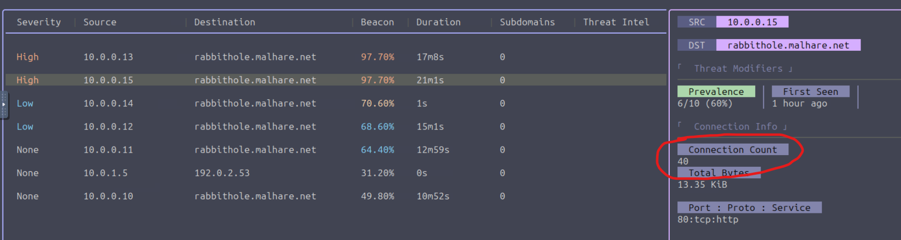
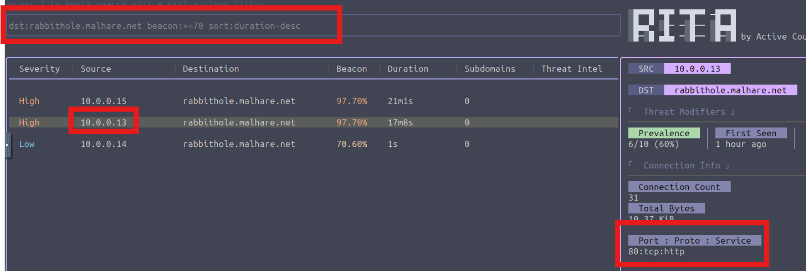

## Walkthrough of Day 22 - C2 Detection - Command & Carol 


## Theory - What will we learn?
* C2 beacon detection
* DNS tunneling detection
* Long connection detection
* Data exfiltration detection
* Checking threat intel feeds
* Score connections by severity
* Show the number of hosts communicating with a specific external IP
* Shows the datetime when the external host was first seen on the network


### What is zeek
* Similar to wireshark, zeek is a NSM(Network Security Monitor)
* Uses logs to summerize the network data 
* files smaller then pcap
* zeek creates seperate log for each protocol

### Types of zeek logs
1. conn.log
* Main conversations log

What to look for when investigating?
* Who talked with who?
* what ports?(mabey port scan?)
* durations of the conversation(What time the connection was made?)
* how much data was transfered
* connection to C2 server

2. http.log
* Records every web request Including
    * URL address
    * user-agent
    * Request type [ GET / POST ]

What to look for when investigating?
* Downloding of malicous files
* Use of strange User-Agent

3. dns.log
* record all DNS requests
* Look for malicous domain
* Look for DGA(Domain Generation Algorithm)

4. files.log
* records all files transfered in the network
    * File size
    * Type(exe,pdf,hta)
    * hash
5. ssl.log / x509.log
* records all HTTPS (encrypted data)
* records the certificate

Look for:
* Fake certificates
* Certificates of known APT

### RITA
`Real Intelligence Threat Analytics`
* Open source tool developed by Active Countermeasures
* takes logs files and analyises them

`Beaconing`
* Knows to find and alert when it recognizes malicous behavior
* Finds DNS tunneling
* Long connections
* Check all ip in blacklists(Threat Intel)
* Detect data exfiltration

#### RITA knows to correlate all the info into valid alerts


### PRACTICAL
1. convert pcap to zeek
```bash
zeek readpcap <pcapfile> <outputdirectory>
```
2. convert zeek to RITA
```bash
rita import --logs <zeek_directory> --database <outputdirectory>
```

3. open RITA
```bash
rita view <RITA Database created in step 2>
```


##
## Answers

#### Q: How many hosts are communicating with malhare.net?
* Lets take the pcap `~/pcaps/rita_challenge.pcap`
* convert it to zeek
```
zeek readpcap ~/pcaps/rita_challenge.pcap ~/zeek_logs/challenge
```
* Create a RITA database
```
rita import --logs challenge/ --database challenge
```
* open RITA
`rita view challenge`

* Check the destination
* count how many connection has the destination
`*malhare.net` 
#### A: `6`

##
#### Q: Which Threat Modifier tells us the number of hosts communicating to a certain destination?


#### A: `Prevalence`


##
#### Q: What is the highest number of connections to rabbithole.malhare.net?
* Check all the connections
* Look at the `Connection Info` section
* find the largest count of connections



#### A: `40`

#### Q: Which search filter would you use to search for all entries that communicate to rabbithole.malhare.net with a beacon score greater than 70% and sorted by connection duration (descending)?

* use the help manu -->
* press `/` --> `?`


#### A: `dst:rabbithole.malhare.net beacon:>=70 sort:duration-desc`

#### Q: Which port did the host 10.0.0.13 use to connect to rabbithole.malhare.net?
* apply the filter from previous question
* Find the connection which
`source == 10.0.0.13`
* check the `conneection info`



#### A: `80`

##


## You completed the room!!!