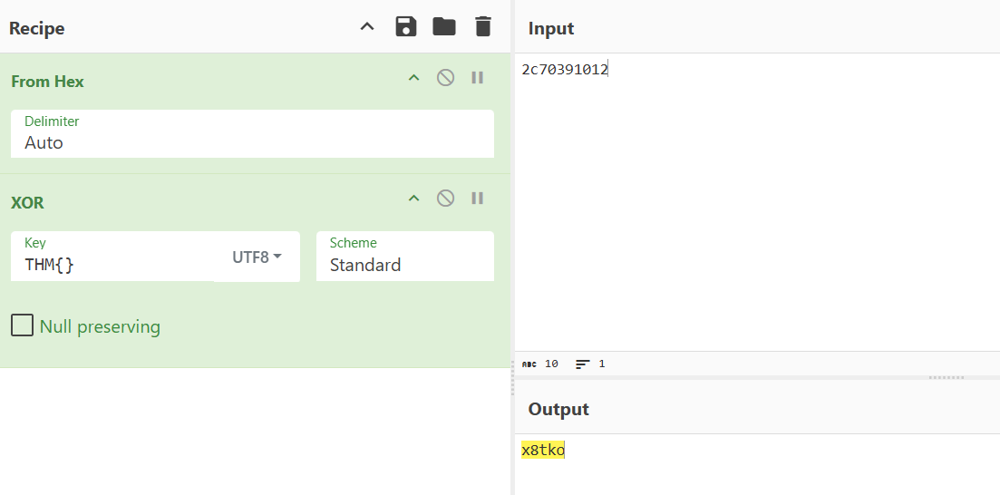
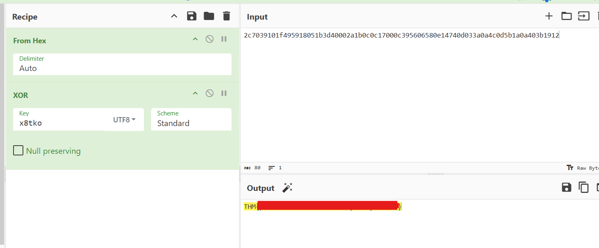

## Walkthrough of Day W1seGuy room - Try Hack Me

* This challenge involves understanding the basics of XOR encryption and decryption.

* First, look at the script attached to the machine. We see a Python script that:
1. takes a Flag
2. Encrypts it with XOR using a random 5-letter key (very important).
	* We get an eample flag format `THM{thisisafakeflag}` 
3. Encodes it into hex.

* In the info section, we are told that port 1337 (TCP) is open.
* lets try to connect...
```bash
telnet $IP 1337
Connected to $IP
Escape character is '^]'.
This XOR encoded text has flag 1: $ENCRYPTED_FLAG
```

### Lets crack it
* We know the first 4 charachters are `THM{` from the example format.
* The last char is `}`.
* Because the flag is encoded into hex, each letter is equal to 2 hex bytes.
```
example:
if the encrypted flag is ----->
2c7039101f495918051b3d40002a1b0c0c17000c395606580e14740d033a0a4c0d5b1a0a403b1912

T = 2c
H = 70
M = 39
{ = 10

* then take the last 2 bytes
} = 12

```
* We know for sure that `THM{}` is XOR to `2c70391012`


#### Important notice
* XOR key is a 2 way
clear_txt XOR key = Dycrypted_text
AND
Dycrypted_text XOR Dycrypted_text = KEY


#### Lets crack it!!!!


* So if we take the 5 bytes of the encrypted text, convert from hex
* and put the  `THM{}` as the key ---> We will get the actual key as the output!!!


#### Final step
* Take the key and dycrypt the whole message


## You completed the room!!!
