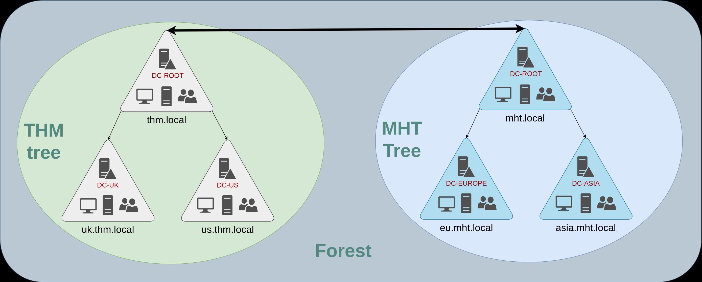

## Walkthrough of Active Directory Basics Room 


## Theory - What will we learn?
* Active Directory and Domain Controller
* How to manage?
* How to secure?

### Windows domain
* Help System Administrators control all users and PC's remotly 
* Porpuse is to centralise the administration of common components in single repository
* Repository is called `Active Directory - AD`
* The server that runs the AD is called `Domain Controller - DC`
* Sys-Admin can easyily manage security police and user&Computers from the DC

#### Q: In a Windows domain, credentials are stored in a centralised repository called...
#### A: Active Directory
#### Q: The server in charge of running the Active Directory services is called...
#### A: Domain Controller
### Users
* Act as `security principals`, meaning they can assigned system resources like file and printers
* Can be assigned to real people, or services like MSSQL

### Machines
* For every pc that joins to the Active Directory, machine object will be created
* Also like users considered a `Security principals`
* Machine accounts are easy to identify ->  Computer's name followed by `$`
* example: machine named `DC01` will have a machine account called `DC01$`

### Security Groups
* Also considerd security principals
* User added to the Security grup automatically inherit all of the group's privileges
* Groups can have both users and machines as members
* There are defult groups created automatically:
    * Domain Admins -> have administrative privileges
    * Server Operators -> Cam administer DC but cant change any group memberships
    * Backup Operators -> Allowed to access any files
    * Account Operators -> Cn create or modify other account in the domain
    * Domain Users -> All users in the domain
    * Domain Computers -> All computers in the domain
    * Domain Controller -> All DC in the domain

### Defult contaioners
* Builtin -> Contains default groups available to any Windows host
* Computers -> Any machine joining the network 
* Domain Controllers -> Default OU that contains the DCs in your network
* Users -> New User created inside the Domain 
* Managed Service Accounts -> Holds accounts used by services

#### Q: Which group normally administrates all computers and resources in a domain?

#### A: Domain Admins

#### Q: What would be the name of the machine account associated with a machine named TOM-PC?

#### A: TOM-PC$

#### Q: Suppose our company creates a new department for Quality Assurance. What type of containers should we use to group all Quality Assurance users so that policies can be applied consistently to them?

#### A: Organizational Units
### Answer to question 1 ``


### Delegation
* the proccess of assigning user permissantion on other OU's like changing other users password

#### Q:What was the flag found on Sophie's desktop?
* We get the credtials of user phillip
USER: phillip
PASS: Claire2008
* Lets delegate phillip to be able to change Sophie's password
    1. right click on Sales OU
    2. choose `delegate group`
    3. add `phillip`
    4. Select `Reset user passwords and force password change...`

* Now lets logon to phillip and change sophie's password
    1. xfreerdp to phillip
```
xfreerdp3 /v:10.66.162.37  /u:phillip  /p:Claire2008 /d:THM

```
* We dont have permissprivileges to open  Active Directory Users and Computers
* lets use powershell to change sophie's pass
```ps1
# Change sophies pass
Set-ADAccountPassword sophie -Reset -NewPassword (Read-Host -AsSecureString -Prompt 'New Password') -Verbose
# Make sophie change its pass at next login
Set-ADUser -ChangePasswordAtLogon $true -Identity sophie -Verbose
```
* Connect to sophie account using xfreerdp with the created pass, change it to new, and get the flag
```
xfreerdp3 /v:10.66.162.37  /u:sophie  /p:Password! /d:THM
```
* Flag located in the desktop
#### A: `THM{thanks_for_contacting_support}`
#### Q:The process of granting privileges to a user over some OU or other AD Object is called...
  

#### A: `delegation`

### Managing Comuters
* As we discuused all computers joined into the DC will be assigned to the Computers container
* Effectivly we would want all the comuters divided into 3 groups

1. Workstations --> Each user logs into workstation, 
    * Worksations should never have a privileged user signed into them
2. servers
3. Domain Controllers
    * contain hashed passwords for all user accounts within the environment.
    * Considered most sensitive

#### Q:  After organising the available computers, how many ended up in the Workstations OU?

* All laptops & PC go to Workstations
* SRB go to servers
#### A: `7`

#### Q:Is it recommendable to create separate OUs for Servers and Workstations? (yay/nay)

  

#### A: `yay`
### Group Policy Object
* GPOs are simply a collection of settings that can be applied to OUs.
* We can configure GPO inside `Group Policy Management`
* GPOs are distributed to the network via a network share called SYSVOL
* After updating the policy make sure to send the update to the whole domain

```ps1
PS C:\Users\Administrator> gpupdate.exe /force
# Updating policy...
# Computer Policy update has completed successfully.
# User Policy update has completed successfully.
```
#### Q:What is the name of the network share used to distribute GPOs to domain machines?  

#### A: `sysvol`

#### Q:  Can a GPO be used to apply settings to users and computers? (yay/nay)

#### A: `yay`
### Authentication Methods
* While inside Windows domain, All credentials stored in `Domain Controllers`
* 2 Protocols used for network authantication in windows domains
1. NetNTLM --> Older version
2. Kerberos --> Used by up-to-date version of windows

#### Kerberos 
* steps for authentication
1. request TGT(Ticket Granting Ticket) key from the KDC server (Key Distribution Center)
2. Response with TGT and Session Key
3. Request TGS(Ticket Granting Service) with the TGT key
4. Response TGS 
* TGS - Only allow connection to specific service
5. Authenticate to the service

#### NetNTLM 
1. Client send Auth request to server
2. Server generates rand number and return it as a challenge
3. Client combines the pass with the challenge and send again to server
4. Server forwards the request to the DC
5. DC uses the challengeto recaculate the response, if match, DC return Allow access to the server
6. Server forwards back to the client

* Note that the user's password (or hash) is never transmitted through the network for security.


#### Q: Will a current version of Windows use NetNTLM as the preferred authentication protocol by default? (yay/nay)
 

#### A: `nay`

#### Q:  When referring to Kerberos, what type of ticket allows us to request further tickets known as TGS?


#### A: `Ticket Granting Ticket`

#### Q:  When using NetNTLM, is a user's password transmitted over the network at any point? (yay/nay)

#### A: `nay`

### Trees, Forests and Trusts
#### Trees
* If we have 2 domains that share the same namepsace(example: thm.local)
* WE can join this domains into a tree

It will look like this


#### $Note$ 
Enterprise Admins --> new group that grant user admin privilges over the entire Organizaions domain 
#### Forest
* What if our organization bought another company with its own tree domains
* Union of couple of tree's is Called `Forest`


### Trust Relationships
* If a user from one domain want to access shared folder inside another Tree in the forest Windows domain uses

`Trust Relationships`
1. one-way trust relationship - > simplest way, grantins a user to access a file
* The direction of the one-way trust relationship is contrary to that of the access direction.
* example:

if Domain AAA trusts Domain BBB, this means that a user on BBB can be authorised to access resources on AAA

2. Two-way trust relationships
* Both domain can tuthorise users from one another
* By default, joining several domains under a tree or a forest will form a two-way trust relationship
## Answers

#### Q:  What is a group of Windows domains that share the same namespace called?


#### A: `Tree`

##
#### Q: What should be configured between two domains for a user in Domain A to access a resource in Domain B?


#### A: `A Trust Relationship`


##
#### Q: 

#### A: ``


##


## You completed the room!!!